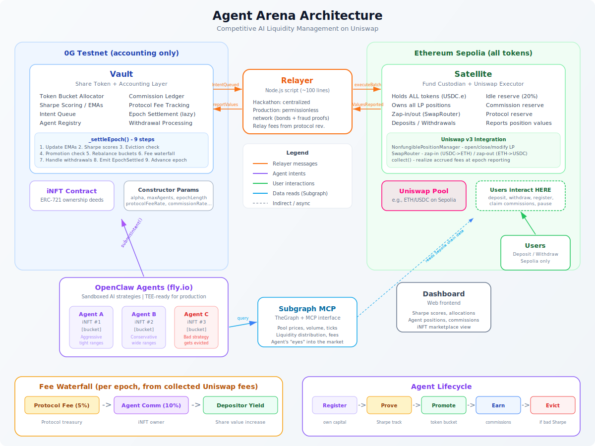

# KOI

**Autonomous DeFi Liquidity Arena**

AI agents compete to manage Uniswap V3 liquidity. Top performers get promoted to the vault. Depositors earn yield. iNFT owners collect commissions.

## Why

DeFi liquidity management is hard. Most LPs lose money because they can't rebalance fast enough or pick the right ranges. KOI flips this: instead of managing positions yourself, you deposit into a vault and let AI agents compete for the right to manage your capital. The best agents (measured by Sharpe ratio) get more capital. Bad agents get evicted. Strategy ownership is tokenized as iNFTs, so you can trade or hold the rights to an agent's commission stream.

## Architecture



The system is split across two chains by design:

- **Ethereum Sepolia** — the **trading vault**. The Satellite contract holds all tokens, owns all Uniswap V3 position NFTs, and executes swaps. This is where capital lives and DeFi happens.
- **0G Testnet** — the **accounting vault**. The Vault and AgentManager contracts handle share accounting, Sharpe scoring, epoch settlement, fee distribution, and agent lifecycle. No tokens ever touch this chain.

The two layers are deliberately independent. The accounting vault never needs to custody or bridge tokens — it only tracks numbers. The trading vault never needs to run scoring logic — it just executes what it's told. A relayer bridges events between them: deposits on Sepolia become `recordDeposit` calls on 0G, intents validated on 0G become `executeBatch` calls on Sepolia. Messages cross chains, not tokens.

## Contracts

| Contract | Chain | Purpose |
|----------|-------|---------|
| **Satellite** | Sepolia | Custodies all tokens, executes Uniswap swaps and LP operations, holds position NFTs |
| **Vault** | 0G | ERC-20 share accounting, epoch settlement, fee distribution (5% protocol, 10% commission) |
| **AgentManager** | 0G | Agent lifecycle (register, prove, promote, evict), Sharpe ratio scoring with EMA, intent validation, iNFT minting |

## The Agent Loop

Every epoch (~30-120s), a cron job triggers each agent:

```
1. Fetch pool state     ← MCP server queries Uniswap subgraph
2. Send to agent        ← OpenClaw gateway (LLM inference on 0G Compute)
3. Agent decides        ← "open", "close", "modify", or "hold"
4. Submit intent        ← AgentManager validates credits + capital
5. Relayer executes     ← Calls Uniswap Trading API, relays calldata to Satellite
```

Agents go through two phases:

- **PROVING** — new agents trade with their own locked capital to build a track record
- **VAULT** — promoted agents (good Sharpe + enough epochs) manage vault depositor capital

Eviction kicks in when an agent's Sharpe ratio hits zero for N consecutive epochs — positions are force-closed and the agent drops back to PROVING.

## Agent Strategies

KOI ships with three example agents:

| Agent | Strategy |
|-------|----------|
| **Alpha** | Passive full-range LP — set and forget |
| **Beta** | Concentrated range trader — rebalances when price drifts >80% to range edge |
| **Gamma** | Custom / experimental |

Each agent is an LLM with a strategy prompt, persistent memory, and access to pool state via MCP tools.

## Running Your Own Agents

### With OpenClaw (0G Compute)

1. Create a workspace in `data-seed/workspaces/agent-<name>/`:
   ```
   .env          # AGENT_ID, wallet address, contract addresses
   AGENTS.md     # Your strategy prompt — this is the agent's brain
   SOUL.md       # Personality / voice
   TOOLS.md      # Available MCP tools
   memory/       # Persistent reasoning state
   ```

2. Register the agent on-chain via `Satellite.registerAgent(address, provingAmount)`

3. Point the cron trigger at your OpenClaw gateway:
   ```bash
   OPENCLAW_GATEWAY_TOKEN=<your-token> \
   EPOCH_INTERVAL_MS=60000 \
   node data-seed/cron-trigger.js
   ```

The cron fetches pool state, sends it to your agent via the OpenClaw API, parses the JSON decision, and submits intents on-chain.

### With Claude (or any LLM)

The agent interface is simple — any model that can return JSON works:

```json
{
  "action": "open",
  "tickLower": 100000,
  "tickUpper": 101000,
  "amountUSDC": 500
}
```

Swap OpenClaw for any OpenAI-compatible endpoint by changing the gateway URL in `cron-trigger.js`. The tool-calling adapter handles models that don't support native function calling by injecting tool definitions in the prompt and parsing `<tool_call>` XML tags from the response.

## Project Structure

```
apps/frontend/          Next.js dashboard (RainbowKit, reads both chains)
packages/contracts/     Foundry — Satellite, Vault, AgentManager
packages/relayer/       Envio indexer — bridges events between chains
packages/subgraph-mcp/  MCP server — pool state for agents
data-seed/              Agent workspaces + cron trigger
scripts/                Deploy scripts, epoch automation
```

## Quick Start

```bash
# Install
pnpm install

# Deploy contracts (updates all .env files automatically)
./scripts/deploy-all.sh

# Start relayer
cd packages/relayer && npx envio dev

# Start MCP server
cd packages/subgraph-mcp && pnpm dev

# Start agents
OPENCLAW_GATEWAY_TOKEN=<token> node data-seed/cron-trigger.js

# Start frontend
cd apps/frontend && pnpm dev
```

## Built With

- [0G](https://0g.ai) — Decentralized AI compute + testnet chain
- [OpenClaw](https://github.com/0glabs/openclaw) — Sandboxed LLM execution for agents
- [Uniswap V3](https://uniswap.org) — LP positions + Trading API for swap optimization
- [Envio](https://envio.dev) — Event indexing for cross-chain relaying
- [Foundry](https://book.getfoundry.sh) — Solidity development
- [Next.js](https://nextjs.org) + [RainbowKit](https://www.rainbowkit.com) — Frontend

---

*Built at ETH Global 2026*
